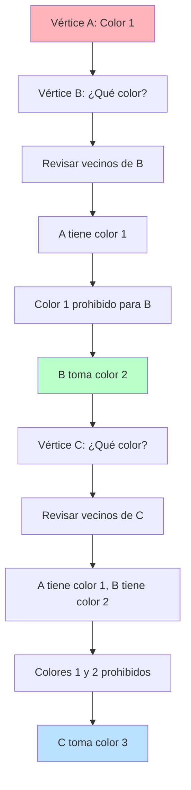

# Algoritmo Codicioso: First-Fit

## ¿Cómo funciona el algoritmo codicioso?

El enfoque **first-fit** (primer ajuste) es una estrategia codiciosa que toma decisiones inmediatas sin reconsiderarlas posteriormente. Es como organizar una biblioteca: tomas cada libro y lo colocas en el primer estante disponible donde quepa, sin preocuparte por optimizaciones futuras.

La filosofía central es simple pero efectiva: **para cada vértice, asigna el color más pequeño que no genere conflictos con sus vecinos ya coloreados**.

## La estrategia paso a paso

El algoritmo procede de manera secuencial y determinística:

1. **Ordena** los vértices según algún criterio (por defecto, orden natural)
2. **Inicializa** el primer vértice con el color 1
3. **Para cada vértice restante:**
   - Examina los colores de sus vecinos ya coloreados
   - Identifica el conjunto de colores "prohibidos"
   - Asigna el **primer color disponible** (el menor número no prohibido)
4. **Continúa** hasta procesar todos los vértices

¿Por qué "primer ajuste"? Porque no busca el color "óptimo" para cada vértice, sino simplemente el **primero que funcione**.

## Visualización del proceso

Este diagrama muestra cómo el algoritmo **nunca retrocede**: una vez asignado un color, la decisión es definitiva.

## ¿Por qué funciona?

El algoritmo codicioso tiene características distintivas que lo hacen valioso:

- **Simplicidad conceptual:** La lógica es intuitiva y fácil de implementar
- **Eficiencia temporal:** Procesa cada vértice exactamente una vez
- **Determinismo:** Dados los mismos datos y orden, produce siempre el mismo resultado
- **Garantía de coloreo válido:** Siempre encuentra una solución (aunque no necesariamente óptima)

**La trade-off fundamental:** Sacrifica optimalidad por velocidad. Puede usar más colores de los estrictamente necesarios, pero lo hace de manera eficiente.

## Análisis de complejidad

**Tiempo:** O(n²) en el peor caso, donde n es el número de vértices.
**Espacio:** O(n) para almacenar el coloreo y estructuras auxiliares.

**Interpretación práctica:**
- **Grafos pequeños:** Instantáneo, pero podría usar colores extra
- **Grafos medianos:** Segundos, calidad razonable
- **Grafos grandes:** Escalable, útil cuando la velocidad es prioritaria

La complejidad cuadrática surge porque para cada vértice debemos examinar potencialmente todos sus vecinos (en grafos densos, esto puede ser O(n) vecinos por vértice).

**¿Cuándo preferir este enfoque?** Cuando necesitas una solución rápida y aceptable, especialmente en aplicaciones en tiempo real donde la velocidad es más crítica que la optimalidad perfecta.