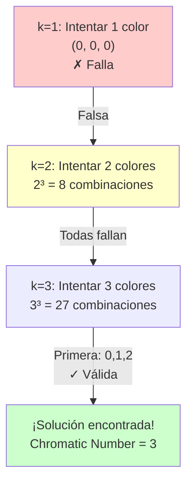

# Algoritmo de Fuerza Bruta (Exhaustive Search)

## Concepto Fundamental

El algoritmo de **fuerza bruta** o **búsqueda exhaustiva** para coloreo de grafos es el enfoque más directo y conceptualmente simple: prueba **todas las posibles asignaciones de colores** hasta encontrar una que sea válida.

## Idea Clave

Partiendo de un número mínimo de colores k=1, generamos todas las combinaciones posibles de asignar esos k colores a los nodos. Si alguna es válida (sin nodos adyacentes del mismo color), la retornamos. Si ninguna funciona con k colores, incrementamos k y repetimos el proceso.

```
k=1: Intentar colorear con 1 color
     ↓ No válido (casi siempre)
k=2: Intentar colorear con 2 colores
     ↓ Generar todas las 2^n combinaciones
     ↓ Si alguna es válida → ENCONTRADA
     ↓ Si ninguna funciona → continuar
k=3: Intentar colorear con 3 colores
     ↓ Generar todas las 3^n combinaciones
     ...
```

## Pseudocódigo

```
función color_graph():
    para k = 1 hasta número_de_nodos:
        para cada combinación en generar_todas_k_coloraciones(nodos, k):
            si es_valida_coloración(combinación):
                retornar combinación
    
función generar_todas_k_coloraciones(nodos, k):
    # Producto cartesiano: cada nodo puede tener color 0 a k-1
    retornar producto(rango(k), repetido len(nodos) veces)

función es_valida_coloración(coloración):
    para cada arista (u, v) en el grafo:
        si coloración[u] == coloración[v]:
            retornar falso
    retornar verdadero
```

## Ejemplo Paso a Paso

Consideremos un grafo pequeño con 3 nodos formando un triángulo:

```
    X
   / \
  Y---Z

Aristas: X-Y, Y-Z, Z-X
```

### Intento con k=1 color

Combinaciones posibles con 1 color:
- (0, 0, 0) → X=0, Y=0, Z=0

Validación:
- ¿X(0) ≠ Y(0)? NO ✗
- No es válida

### Intento con k=2 colores

Combinaciones posibles con 2 colores: 2³ = 8
- (0, 0, 0) → No válida (todos tienen color 0)
- (0, 0, 1) → X=0, Y=0, Z=1 → X-Y comparten color ✗
- (0, 1, 0) → X=0, Y=1, Z=0 → X-Z comparten color ✗
- (0, 1, 1) → X=0, Y=1, Z=1 → Y-Z comparten color ✗
- ... (todas las 8 combinaciones fallan)

Ninguna combinación con 2 colores funciona.

### Intento con k=3 colores

Primera combinación:
- (0, 1, 2) → X=0, Y=1, Z=2

Validación:
- ¿X(0) ≠ Y(1)? SÍ ✓
- ¿Y(1) ≠ Z(2)? SÍ ✓
- ¿Z(2) ≠ X(0)? SÍ ✓
- ¡Válida! → Retornamos esta coloración

**Número cromático encontrado: 3**

## Visualización del Árbol de Búsqueda



## Características del Algoritmo

| Característica | Valor |
|---|---|
| **Exactitud** | ✓ Encuentra el número cromático óptimo |
| **Completitud** | ✓ Siempre encuentra solución (si existe) |
| **Velocidad** | ✗ Muy lento para grafos grandes |
| **Memoria** | ✓ Complejidad espacial moderada |
| **Aplicabilidad** | Solo grafos pequeños (< 15-20 nodos) |

## Análisis de Complejidad

### Complejidad Temporal

Para un grafo con n nodos y m aristas, siendo k el número de colores a intentar:

$$T(n, k) = \sum_{i=1}^{k} i^n \times O(m)$$

donde:
- $i^n$ es el número de combinaciones a probar con i colores
- $O(m)$ es el costo de validar cada combinación

En el peor caso (cuando el número cromático es n):

$$T_{\text{worst}} = O(n^n \times m)$$

**Ejemplos prácticos:**
- 5 nodos: ~10^6 operaciones (milisegundos)
- 10 nodos: ~10^10 operaciones (segundos a minutos)
- 15 nodos: ~10^16 operaciones (impracticable)

### Complejidad Espacial

$$S(n) = O(n)$$

Solo necesitamos almacenar:
- La lista de nodos: O(n)
- La coloración actual: O(n)
- La representación del grafo: O(n + m)

## Implementación en Python

La implementación completa está en `brute_force_coloring.py`:

```python
from itertools import product

class BruteForceColoring:
    def __init__(self, graph):
        self.graph = graph
        self.coloring = {}
    
    def color_graph(self):
        """Find valid coloring using exhaustive search."""
        nodes = list(self.graph.get_nodes())
        
        # Intentar con k colores incrementales
        for k in range(1, len(nodes) + 1):
            valid = self._find_valid_coloring_with_k_colors(nodes, k)
            if valid is not None:
                self.coloring = valid
                return self.coloring
        
        return {}
    
    def _find_valid_coloring_with_k_colors(self, nodes, k):
        """Search for valid coloring with exactly k colors."""
        # Producto cartesiano: todas las k-coloraciones
        for color_combination in product(range(k), repeat=len(nodes)):
            coloring = dict(zip(nodes, color_combination))
            if self._is_safe_coloring(coloring):
                return coloring
        return None
    
    def _is_safe_coloring(self, coloring):
        """Verify no adjacent nodes share the same color."""
        for edge in self.graph.get_edges():
            node1, node2 = edge
            if coloring[node1] == coloring[node2]:
                return False
        return True
    
    def get_chromaticity(self):
        """Get the chromatic number."""
        if not self.coloring:
            self.color_graph()
        return max(self.coloring.values()) + 1 if self.coloring else 0
```

## Ventajas y Desventajas

### ✓ Ventajas

1. **Concepto simple**: Fácil de entender y explicar
2. **Solución óptima**: Encuentra el número cromático exacto
3. **Completitud garantizada**: Siempre encuentra solución
4. **Educativo**: Ideal para aprender conceptos fundamentales
5. **Determinístico**: Resultado reproducible

### ✗ Desventajas

1. **Complejidad exponencial**: O(k^n) crece rápidamente
2. **Impracticable**: Inutilizable para grafos reales (típicamente > 20 nodos)
3. **Sin optimizaciones**: No aprovecha estructura del grafo
4. **Redundancia**: Explora muchas coloraciones inválidas
5. **No escalable**: Inutilizable para aplicaciones prácticas

## Comparación con Otras Estrategias

| Algoritmo | Velocidad | Optimalidad | Aplicabilidad |
|---|---|---|---|
| **Fuerza Bruta** | Muy lenta | ✓ Óptimo | Grafos pequeños, investigación |
| **Codicioso** | Muy rápida | ✗ Aproximado | Aplicaciones prácticas |
| **Welsh-Powell** | Rápida | ✗ Aproximado | Mejor heurística que codicioso |
| **Branch & Bound** | Moderada | ✓ Óptimo | Balance entre exactitud y velocidad |

## Cuándo Usar Fuerza Bruta

### ✓ Usar si:
- Grafo tiene menos de 15 nodos
- Necesitas el número cromático exacto
- Propósito educativo o investigativo
- Verificación de optimalidad de otras soluciones

### ✗ No usar si:
- Grafo tiene más de 20 nodos
- Necesitas resultado rápido en aplicación real
- Topología del grafo es compleja
- Presupuesto computacional es limitado

## Optimizaciones Posibles (No Implementadas)

1. **Poda temprana**: Descartar asignaciones parciales inválidas
2. **Ordenamiento de nodos**: Priorizar nodos de alto grado
3. **Memoización**: Cachear subgrafos ya coloreados
4. **Branch and Bound**: Usar límites inferiores para podar búsqueda

## Aplicaciones Reales

Aunque impracticable para casos generales, se usa en:

1. **Investigación teórica**: Determinar números cromáticos exactos
2. **Verificación**: Confirmar optimalidad de otras soluciones
3. **Benchmarking**: Generar instancias de prueba para otros algoritmos
4. **Educación**: Enseñanza de algoritmos y complejidad computacional

## Conclusión

El algoritmo de fuerza bruta es el enfoque más puro para coloreo de grafos: prueba todas las posibilidades sin asunciones. Su elegancia conceptual contrasta con su inutilidad práctica para grafos grandes, ilustrando perfectamente por qué la informática teórica busca algoritmos más eficientes.

**Lección clave**: Exactitud no siempre significa practicidad. Los algoritmos aproximados (como codicioso o Welsh-Powell) frecuentemente son superiores en aplicaciones reales, incluso si no garantizan soluciones óptimas.
