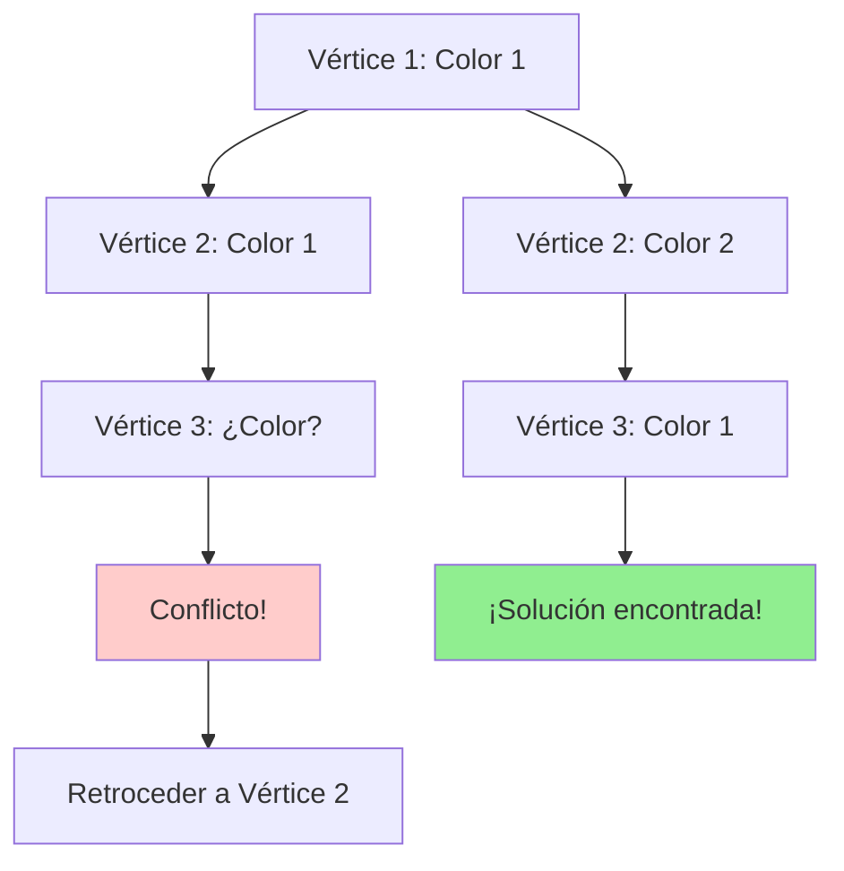

# Algoritmo de Fuerza Bruta: Backtracking

## ¿Cómo funciona la fuerza bruta?

El enfoque de **backtracking** explora sistemáticamente el espacio de soluciones, retrocediendo cuando encuentra configuraciones inválidas. Es como resolver un sudoku: pruebas un número, continúas hasta encontrar una contradicción, y entonces retrocedes para probar la siguiente opción.

## La estrategia paso a paso

El algoritmo funciona mediante exploración recursiva:

1. **Asigna** el primer color disponible al vértice actual
2. **Verifica** que no haya conflictos con vértices adyacentes
3. **Recursiona** al siguiente vértice si la asignación es válida
4. **Retrocede** si no encuentra coloreo válido para el vértice actual
5. **Continúa** hasta colorear completamente o agotar posibilidades

## Visualización del proceso

## ¿Por qué funciona?

El backtracking **garantiza encontrar la solución óptima** porque:

- **Exploración exhaustiva:** Examina todas las combinaciones posibles
- **Poda inteligente:** Abandona ramas que no pueden llevar a soluciones válidas
- **Optimalidad:** Al probar desde el mínimo número de colores, la primera solución encontrada es óptima

## Análisis de complejidad

**Tiempo:** O(k^n) en el peor caso, donde k es el número de colores y n el número de vértices.
**Espacio:** O(n) para almacenar el coloreo actual y la pila de recursión.

**Interpretación práctica:**
- **Grafos pequeños (≤ 10 vértices):** Respuesta inmediata
- **Grafos medianos (10-20 vértices):** Segundos a minutos
- **Grafos grandes (> 20 vértices):** Potencialmente impracticable
