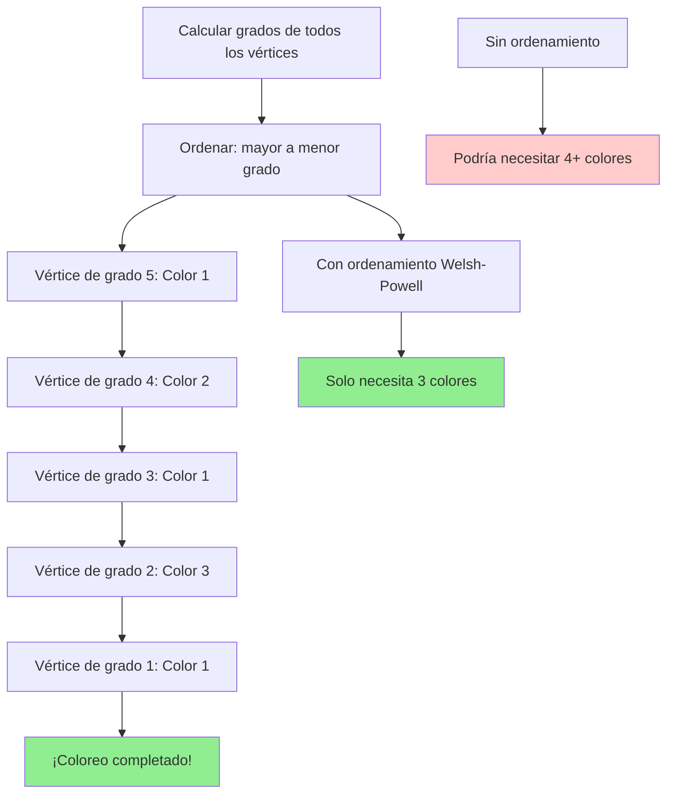

# Heurística Welsh-Powell

## ¿Cómo funciona Welsh-Powell?

La heurística **Welsh-Powell** es una estrategia codiciosa inteligente que incorpora una intuición clave: **los vértices más "problemáticos" deberían colorearse primero**. Es como organizar una reunión complicada: programas primero a las personas con más conflictos de horario, porque son las más difíciles de acomodar.

La insight fundamental radica en el **ordenamiento por grado**: los vértices con más conexiones (mayor grado) son más restrictivos, por lo que al colorearlos temprano tenemos más flexibilidad para los vértices restantes.

## La estrategia paso a paso

El algoritmo combina preparación inteligente con ejecución codiciosa:

1. **Calcula el grado** de cada vértice (número de conexiones)
2. **Ordena los vértices** de mayor a menor grado
3. **Aplica first-fit** siguiendo este orden optimizado:
   - Para cada vértice en la lista ordenada
   - Examina los colores de sus vecinos ya coloreados
   - Asigna el primer color disponible
4. **Continúa** hasta completar el coloreo

¿Por qué este orden importa? Los vértices de alto grado tienen **menos opciones de color** conforme avanza el algoritmo, mientras que los vértices de bajo grado son más **flexibles** y se adaptan mejor a las restricciones existentes.

## Visualización del proceso

La diferencia clave está en la **fase de preparación**: invertir tiempo en el ordenamiento inicial puede reducir significativamente el número total de colores necesarios.

## ¿Por qué funciona?

Welsh-Powell mejora la estrategia codiciosa básica mediante **inteligencia en el ordenamiento**:

- **Minimiza conflictos futuros:** Vértices de alto grado coloreados temprano dejan más opciones disponibles
- **Reduce fragmentación de colores:** Evita desperdiciar colores en vértices que podrían reutilizar colores existentes
- **Mantiene eficiencia:** El overhead del ordenamiento es compensado por mejores decisiones
- **Heurística probada:** Frecuentemente produce resultados cercanos al óptimo en grafos reales

**La intuición clave:** Es más fácil encontrar un color para un vértice con pocas conexiones que para uno con muchas conexiones.

## Análisis de complejidad

**Tiempo:** O(n² + m) donde n es el número de vértices y m el número de aristas.
**Espacio:** O(n) para almacenar el coloreo y el ordenamiento.

**Desglose temporal:**
- Cálculo de grados: O(m)
- Ordenamiento: O(n log n)
- Coloreo first-fit: O(n²) en el peor caso
- **Dominante:** O(n²) para grafos densos

**Interpretación práctica:**
- **Grafos pequeños:** Resultado excelente con overhead mínimo
- **Grafos medianos:** Mejor calidad que first-fit básico con tiempo similar
- **Grafos grandes:** Escalable y frecuentemente superior a alternativas simples

**¿Cuándo preferir Welsh-Powell?** Cuando buscas un buen balance entre calidad de solución y eficiencia computacional. Es especialmente efectivo en grafos donde la distribución de grados es heterogénea.